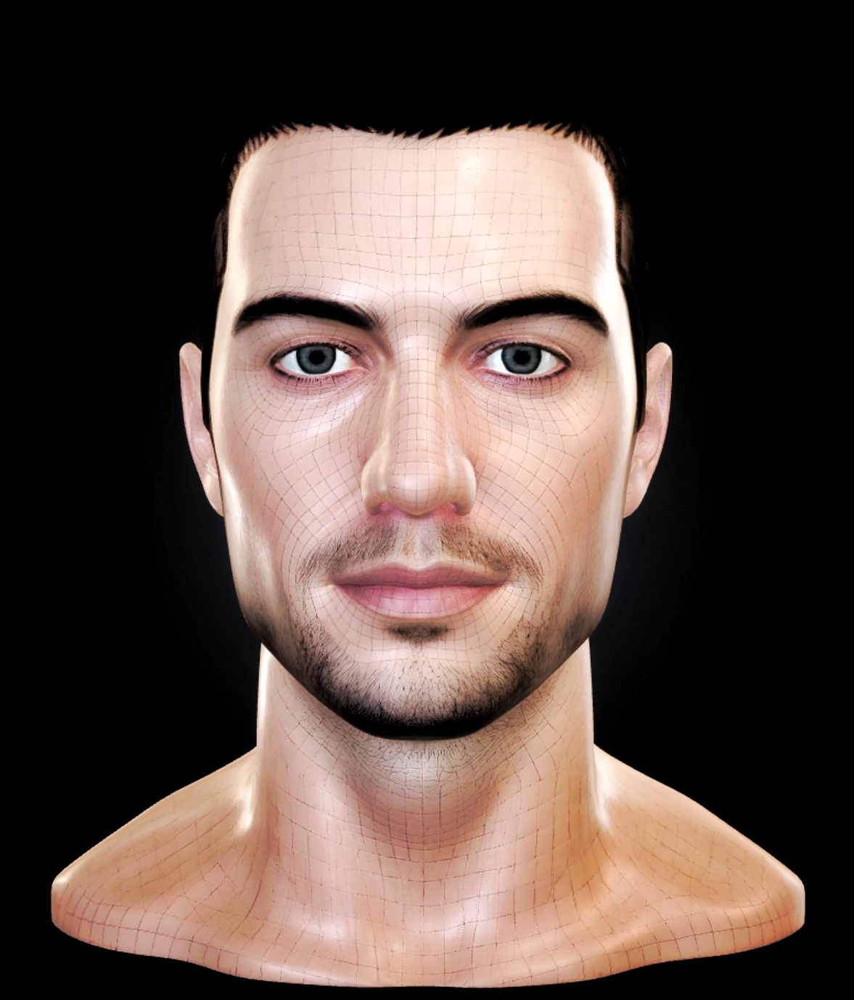

demo:
https://iusmusic.github.io/face/

Animated face designed to give a language model a visual presence across devices while keeping the intelligence separate from the avatar itself. The goal is to preserve a unique face shape and personality, then build a cross-platform application around it that can listen, speak, react emotionally, and communicate through an LLM API. 
The face acts as its expressive interface, turning responses into lifelike visual reactions through animation, speech, and emotion mapping. This creates a more human and engaging way to interact with AI on Linux, other desktop systems, and eventually Android.

Copyright © 2026 Pezhman Farhangi. All rights reserved.

This repository is provided for viewing only.
